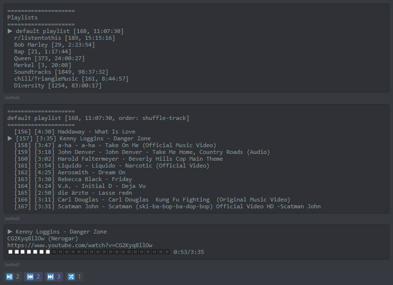

# SandstormBot

## Features

SandstormBot is a cross platform self hostable music bot for discord written in java. It's mainly aimed at smaller private discord servers.

Key features include:
1. It runs on pretty much any hardware that supports java, including a RaspberryPi. (tested on a RaspberryPi 3B)
2. It uses youtube-dl to download sound files and supports a wide variety of different hosting platforms. (any of these platforms should work: https://rg3.github.io/youtube-dl/supportedsites.html) It can also play local music files.
3. Music can be sorted in playlists and played back in 3 modes:
	* default (play songs in their default order)
	* shuffle-track (play songs in a random order)
	* shuffle-album (shuffle whole albums based on the song metadata)
4. The interface is designed to be easily usable. Reaction buttons can be configured for highly used commands.
5. [Impulse response](en.wikipedia.org/wiki/Impulse_response) audio filters can be added to significantly enhance the listening experience.

## Installation
### Requirements
1. A JVM version 1.8 or newer.
2. FFmpeg
	* On Windows, download the newest version from [https://www.ffmpeg.org/download.html](https://www.ffmpeg.org/download.html).
	* If you want to install the bot on a RaspberryPi, you need a newer FFmpeg version than is available on the standard repository.
	You can get one here: [https://johnvansickle.com/ffmpeg/](https://johnvansickle.com/ffmpeg/). If you want to use the default version, audio filters will not be available.
3. youtube-dl
	* On Windows, download the newest version from [https://rg3.github.io/youtube-dl/download.html](https://rg3.github.io/youtube-dl/download.html).
	* On Linux, download youtube_dl through pip (the python package manager): `sudo pip install --upgrade youtube_dl` to install or update.
	* This dependency should be updated regularly.
4. curl
	* On windows, download the executable from [https://curl.haxx.se/windows/](https://curl.haxx.se/windows/).
	* On Linux this is probably already installed. If it's not, install with: `sudo apt-get install curl`.

### Setup
1. Download the newest release.
2. Extract the archive wherever you want.
	* If you want to run the bot on a RaspberryPi I recommend extracting it on an external hard drive. The bot can write a lot of data to the file system, which can wear down the SD card.
3. Copy `config/config_example.json` to `config/config.json`.
4. Fill out the newly created `config/config.json`.
	* **IMPORTANT** If the external programs you use are not located in your $PATH, you have to modify the command locations in the config file.
5. Add the bot to your server.
	* Go to [https://discordapp.com/oauth2/authorize?&client_id=CLIENT_ID&scope=bot&permissions=8](https://discordapp.com/oauth2/authorize?&client_id=<CLIENT_ID>&scope=bot&permissions=8).
	* Replace `CLIENT_ID` with your bots client id.
	* Make sure the bot is listed as a user on your server before proceeding to the next step.
6. Run the bot.
	* On Windows `bin\sandstormBot.bat`.
	* On Linux `bin/sandstormBot`.

Experienced users may try to run development builds by cloning the repository and running the bot with `gradlew run`.

### Usage
 - `!join` the bot will join your current voice channel

Manage playlists:
 - `!playlist create <name>` create a playlist
 - `!playlist remove <name>` remove the specified playlist
 - `!playlist switch <name>` switch to the specified playlist
 - `!order <order>` set the playback order of the current playlist to `<order>`
 	* available options are `default` `shuffle-track` `shuffle-album`

Manage songs:
 - `!add <search>` add a song (or multiple songs) to the current playlist
 - `!addl <search>` add a song (or multiple songs) from your local music directory to the current playlist
 - `!queue <search>` queue a song (or multiple songs) to be played once
 - `!queuel <search>` queue a song (or multiple songs) from your local music directory to be played once
 - `!remove <search>` remove a song (or multiple songs) from the current playlist
 - `!kick` remove the current song from the current playlist
 - `!next` skip to the next song
 - `!next <search>` skip to the next song that includes `<search>` in its name
 - `!previous` skip to the previous song

Additional:
 - `!filter <filtername>` set the impulse response filter to `<filtername>`
 	* Filters can be placed in the `IR` directory
 - `!filter` clears the impulse response filter
